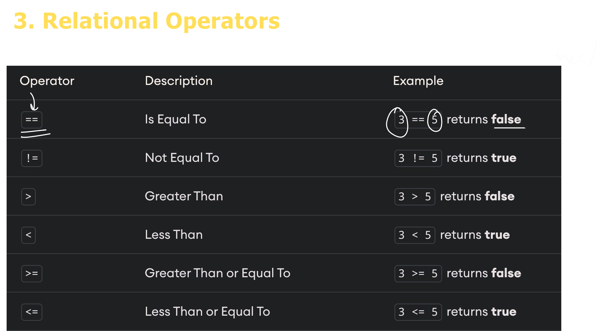
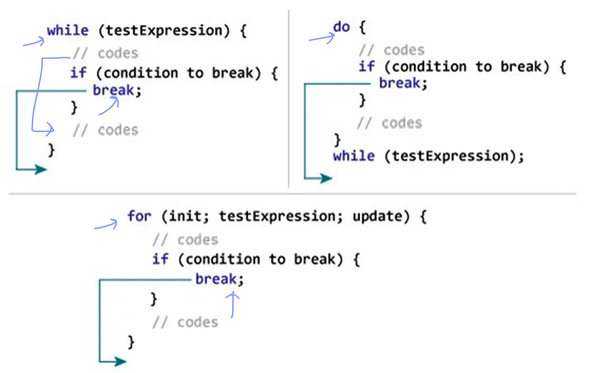
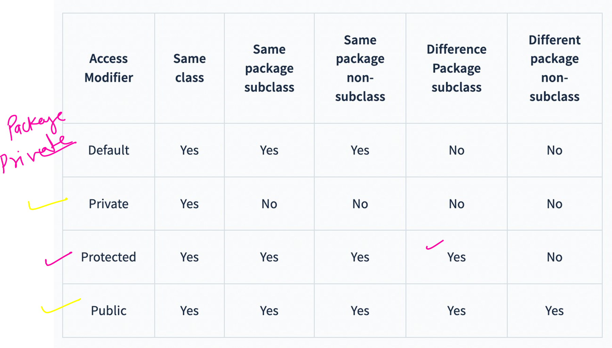

<ol type="1">
    <li> Programming Language </li>
    <li> Working of a Java Program </li>
    <li> Basic Java Program </li>
    <li> Keywords in Java </li>
    <li> Variables in Java </li>
    <li> Data Types in Java </li>
    <li> Types Conversion in Java </li>
    <li> Java Comments </li>
</ol>

<h3>Programming Language</h3>

<h3>Working of a Java Program</h3>

    JvM: JVM (Java Virtual Machine) is an abstract machine that enables your  computer to run a Java program.
    When you run the Java program, Java compiler first compiles your Java code to  bytecode. 
    Then, the JVM translates bytecode into native machine code 
    (set of  instructions that a computer's CPU executes directly).

<h3> JvM, JRE and JDK </h3>

    JRE (Java Runtime Environment) is a software package  that provides Java class libraries, 
    Java Virtual Machine  (JVM), and other components that are required to run  Java applications.

JDK (Java Development Kit) is a software development  kit required to develop applications in Java.
    In addition to JRE, JDK also contains a number of  development tools (compilers, JavaDoc, Java Debugger,  etc).

<h3>Basic Java Program</h3>

<code>

    package A_Basic_Java_Program;

    public class HelloJava {

        public static void main(J_String[] args) {
            System.out.println("Hello Java ");
        }
    }

</code>

<h3>Java Keywords</h3>

<h3>Java Variables</h3>

<h4>Rules for Naming variables in Java</h4>
<ul>
<li>Java is case−sensitive. Hence, age and AGE are two different variables.</li>
<li>Variables must start with either a letter or an underscore, _ or a dollar, $  sign.</li>
<li>Variable names can't use whitespace.</li>
<li>Variable names cannot be a keyword.</li>
</ul>

<h3>Datatypes In Java </h3>

<h4>Data Types Implicit Conversion</h4>

<h3>Data Types Explicit Conversion</h3>

It is done manually by the programmer. If we do not perform casting then the  compiler reports a compile−time error.

<h3>Java Comments</h3>

In computer programming, comments are a portion of the program that are  completely ignored by Java compilers. They are mainly used to help  programmers to understand the code.

 A single−line comment starts and  ends in the same line.
        To write a  single−line comment, we can use  the // symbol.

 When we want to write comments  in multiple lines,
            we can use the  multi−line comment.
            To write  multi−line comments, we can use  the /*....*/ symbol.

<h3>Binary Number System,  Java Operators  &  Taking User Input</h3>

<ul>
    <li>Decimal to binary</li>
    <li>Binary to decimal</li>
    <li>Binary Addition</li>
    <li>Binary Subtraction</li>

</ul>

<h3>Types of Operators in Java</h3>
<ol>
<li>Arithmetic Operators</li>
<li>Assignment Operators</li>
<li>Relational Operators</li>
<li>Logical Operators</li>
<li>Unary Operators</li>
<li>Bitwise Operators</li>
</ol>

<h4>Other Operators</h4>

Increment decrement

Ternary Operators

<h3>Taking User Input</h3>

In order to use the object of Scanner, we need to import java.util.Scanner  package.

<h4>Various Input types using Scanner </h4>

We can use nextLong(), nextFloat(), nextDouble(), and next() methods to get  long, float, double, and string input respectively from the user.

It is recommended to close the scanner object once the  input is taken using the close() method

<h3>Java Conditionals Statements</h3>

<ol>
    <li>if−else statement</li>
    <li>if−else if− else statement</li>
    <li>Nested if−else statement</li>
    <li>Working with the Logical Operators</li>
    <li>Java Ternary Operator</li>
    <li>Java Switch statement</li>
</ol>

<h4>Java If-else statement</h4>

The if statement executes a certain section of code if the test expression is  evaluated to true.

Statements inside the body of else block are executed if the test expression is  evaluated to false. This is known as the if−else statement in Java.

<h4>Java If-else If-else statements</h4>

In Java, we have an if...else...if ladder, that can be used to execute one block of  code among multiple other blocks.

<h4>Nested If-else statements</h4>

In Java, we have an if...else...if ladder, that can be used to execute one block of  code among multiple other blocks.

<h4>Java Ternary Operator</h4>

A ternary operator evaluates the test condition and executes a block of code  based on the result of the condition.

The ternary operator can be used to replace certain types of if...else statements.

condition ? expression1 : expression2;

<h3>Java switch statement</h3>

The switch statement or switch case in java is a multi-way branch statement. Based on the value of the expression given, different parts of code can be executed quickly. The given expression can be of a primitive data type such as int, char, short, byte, and char.

<h3>Loops in Java</h3>

<ol>
    <li>for loop</li>
    <li>while loop</li>
    <li>do−while loop</li>
    <li>break & continue statements
    <li>Nested loops</li>
    <li>Labeled break & continue statements</li>
</ol>

<h3>Elements of java loop</h3>
<ul>
    <li>Initialization Expression(s)</li>
    <li>Test Expression(Condition)  </li>
    <li>Update  Expression(s)  </li>
    <li>Body of the loop</li>
</ul>

<h3>Java for Loops</h3>

<code>
         
        String names[] = {"Ram","Shyam","Rahul","Karan","Arjun"};

        for (int i = 0; i < names.length; i++) {
            System.out.println("Name "+(i+1)+" is : "+ names[i]);
        }
</code>

<h3>Java while Loops</h3>

<h3>Java do-while Loops</h3>

<h3>Java break statement</h3>

<h3>Java continue statement</h3>

<h3>Nested loops</h3>

If a loop exists inside the body of another loop, it's called a nested loop.

<h3>Labeled break and continue</h3>

<h3>Arrays in Java</h3>
<ol>
<li>How do the Arrays work?</li>
<li>Creating and Declaring Arrays</li>
<li>for−each loop</li>
<li>Multi−dimensional Arrays</li>

</ol>

<h3>How do arrays work</h3>

Arrays are stored in contiguous memory [consecutive memory locations].

<h3>Creating an array</h3>

            
    declarations
    int intArray[];
    or 
    int[] intArray;

    // allocating memory to array

    intArray = new int[20];

<code>

    int age[]; // declaration
    age = new int[5]; //allocation

    // int age[] = new int[5];

    age[0] = 1;
    age[1] = 2;
    age[2] = 3;
    age[3] = 4;

    System.out.println(age[0]);
    System.out.println(age[1]);
    System.out.println(age[2]);
    System.out.println(age[3]);
    System.out.println(age[4]);
    // System.out.println(age[5]);
    // Exception in thread "main" java.lang.ArrayIndexOutOfBoundsException: Index 5 out of bounds for length 5
    // at arrays.BasicsOfArray.main(BasicsOfArray.java:42)

</code>

<h3>for-each loop</h3>

<code>
        
        String names[] = {"Ram","Shyam","Rahul","Karan","Arjun"};
        for (int i = 0; i < names.length; i++) {
            System.out.println("Name "+(i+1)+" is : "+ names[i]);
        }
</code>

<h3>Multi-Dimensional Array</h3>

<code>

         int mar[][] = {
                        {0, 0, 0},
                        {1, 1, 1},
                        {2, 2, 2},
                        {3, 3, 3},
                    };

        System.out.println(mar[0][0]);
        System.out.println(mar[0][1]);
        System.out.println(mar[0][2]);

        
        int mark[][] = new int[4][3];

        mark[0][0] = 12;
        mark[0][1] = 98;
        mark[0][2] = 108;

        mark[1][0] = 12;
        mark[1][1] = 98;
        mark[1][2] = 108;

        mark[2][0] = 12;
        mark[2][1] = 98;
        mark[2][2] = 108;

        mark[3][0] = 12;
        mark[3][1] = 98;
        mark[3][2] = 108;

</code>

<h3>Methods in Java</h3>
<ol>
<li>How do the functions work?</li>
<li>Declaring a Java Method</li>
<li>Calling a Method</li>
<li>Method return type</li>
<li>Method Parameters</li>
<li>Math Library Methods</li>
</ol>

<h3>How do functions/method work in Java</h3>

A method is a block of code or collection of statements or a set of  code grouped together to perform a certain task or operation. It is  used to achieve the reusability of code.

Components of method

Calling method

Method Parameters

A method parameter is a value accepted by the method. As  mentioned earlier, a method can also have any number of  parameters.

<h3>Math Class Methods</h3>

        Math.min(x,y)
        Math.max(x,y)
        Math.sqrt(x)
        Math.pow(x,y)
        Math.abs(x)
        Math.random()
        Math.floor(x)
        Math.ceil(x)
        Math.round()

<h3>Java String</h3>

In Java, String is basically an object that represents a sequence of char values.  An array of characters works same as Java String.

<ol>
        <li>Basics of string</li>
        <li>How to create string</li>
        <li>How strings stored in java</li>
        <li>Immutability in strings</li>
        <li>Comparing two strings in java</li>
        <li>Java strings methods</li>
</ol>

<h3>How to create string</h3>

 1. String literal 
    
 2. By new literal

<h3>Immutable String in Java</h3>

String objects are immutable. Immutable simply means unmodifiable or  unchangeable.
Once a String object is created its data or state can't be changed

<h3>Comparing two strings</h3>

    The String class equals() method compares the original content of the string. 
    It  compares values of string for equality. String class provides the following two  methods:

<ul>
    <li>
        public boolean equals(Object another) compares this string to the specified  object.
    </li>
    <li>
        public boolean equalslgnoreCase(String another) compares this string to  another string, ignoring case.
    </li>
</ul>

<h3>String methods in Java</h3>

<ol>
    <li>toUpperCase()</li>
    <li>toLowerCase()</li>
    <li>trim()</li>
    <li>startsWith()</li>
    <li>endsWith()</li>
    <li>equals()</li>
    <li>equalsIgnoreCase()</li>
    <li>charAt()</li>
    <li>valueOf()</li>
    <li>replace()</li>
    <li>contains()</li>
    <li>substring()</li>
    <li>split()</li>
    <li>toCharArray()</li>
    <li>isEmpty()</li>
</ol>

<h3>Oops-1</h3>

<ol>
<li>Class and Objects</li>
<li>Constructors</li>
<li>Method and constructor Overloading</li>
<li>This keyword in java</li>
</ol>

<h4>Classes and Objects</h4>

<ol>
    <li>Class is  a blueprint which defines some properties and behaviours.
       And object is an instance of a class which has those properties and
       behaviours attached</li>
    <li>A class is not allocated memory when it is defined.</li>
    <li> An object is allocated memory when it is created.</li>
    <li> Class is logical entity whereas objects are physical entity.</li>
    <li> A class is declared only once. On the other hand, we can create
       multiple objects of class</li>
    <li> A class is a way to arrange data and behaviour information. It is a template
       that must be implemented by its objects. </li>
    <li>A class can also be seen as user defined datatype where any object of
       defined datatype has somme predefined properties and behaviour. </li>
</ol>

<h4>Method Overloading</h4>
    <ol>
        <li>Two or more methods can have the same name inside the same class if they
        accept different arguments. This feature us known as method overloading</li>
        <li>Method overloading is  achieved by either: 
            a.changing the number of arguments 
            b.or changing the datatype of arguments</li>
        <li>It is not method overloading if we only change the return type of methods.
            There must be differences int the number of parameters.</li>
    </ol>

<h4>Constructors</h4>
        <ol>
        <li>Constructors are invoked implicitly when we instantiate object</li>
        <li>Two rules for creating constructors are:</li>
            a. The name of constructors should be same as class 
            b. A java constructor must not have a return type 
        <li>If a class doesn't have constructors, the java compiler automatically create a default constructor during runtime. 
            The default constructor intializes instance variable with default values.</li>
        <li>Default constructor is automatically created by java compiler if it is not
                  explicitly defined</li>
        <li>A constructor cannot be abstract or static or final.</li>
        <li>A constructor can be overloaded but cannot be overriden.</li>
     </ol>

<h3>This keyword in java</h3>

<h3>Oops-2</h3>

<ol>
        <li>Java  Inheritance</li>
        <li> Method Overriding</li>
        <li> super keyword</li>
        <li> this vs super keyword</li>
        <li> final keyword</li>
</ol>

<h4>Java Inheritance</h4>

 Inheritance is one of the key features of OOP that allows us to create a  new class from an existing class.

The new class that is created is known as subclass (child or derived  class) and the existing class from where the child class is derived is  known as superclass (parent or base class).

<h4>Method Overriding</h4>

If a subclass provides the specific implementation of the method that  has been declared by one of its parent class, it is known as method  overriding.

Method overriding is also known as runtime polymorphism. Hence,  we can achieve Polymorphism in Java with the help of inheritance.

<h4>super keyword in Java</h4>

super is a special keyword in Java that is used to refer to the instance of  the immediate parent class.

 Uses of super Keyword in Java :

<ul>
    <li>It is used to refer to an instance variable of the immediate parent  class.</li>
    <li>It is used to invoke a method of the immediate parent class.  It is used to </li>
    <li>Invoke a constructor of immediate parent class.</li>
</ul>

<h3>Final keyword in java</h3>

In Java, the final keyword is a non−access modifier that is used to define  entities that cannot be changed or modified.

<h3>Oops-3</h3>
<ol>
<li>Java Packages</li>
<li>Access modifiers</li>
<li>Java Encapsulation </li>
<li>Data Hiding </li>
<li>The static keyword</li>
</ol>

<h4>Java Packages:</h4>

A package is simply a container that groups related types (Java classes,  interfaces, enumerations, and annotations).

To define a package in Java, we use the keyword package.  Java uses file system directories to store packages.
For example:

<h4>Importing a package</h4>

Java has an import statement that allows you to import an entire  package (as in earlier examples), or use only certain classes and  interfaces defined in the package.

In Java, the import statement is written directly after the package  statement (if it exists) and before the class definition.

<h4>Java Access Modifiers</h4>

In Java, access modifiers are used to set the accessibility (visibility) of  classes, interfaces, variables, methods, constructors, data members,  and the setter methods. For example:

<h4>Java Encapsulation</h4>

Encapsulation refers to the bundling of fields and methods inside a  single class. It prevents outer classes from accessing and changing  fields and methods of a class. This also helps to achieve data hiding.

<h4>Data Hiding</h4>

Data hiding is a way of restricting the access of our data members by  hiding the implementation details. Encapsulation also provides a way for  data hiding.
We can use access modifiers to achieve data hiding.

Note: People often consider encapsulation as data hiding, but that's not  entirely true. Encapsulation refers to the bundling of related fields and  methods together. This can be used to achieve data hiding.
Encapsulation in itself is not data hiding.

<h4>static keyword</h4>

If we want to access class members without creating an instance of the  class, we need to declare the class members static.

Static variables can be accessed by calling the class name of the class.  There is no need to create an instance of the class for accessing the static  variables because static variables are the class variables and are shared  among all the class instances.

    <strong>Static variables</strong>
    <ol>
        <li>Only a single copy of the static variable is created and shared among  all the instances of the class.</li>
        <li>Because it is a class−level variable, memory allocation of such variables  only happens once when the class is loaded in the memory.</li>
        <li>If an object modifies the value of a static variable, the change is  reflected across all objects.</li>
        <li>Static variables can be used in any type of method: static or non−static.</li>  <li>Non−static variables cannot be used inside static methods. It will throw  a compile−time error.</li>
        <li>The static members and methods belong to the class rather than the  instance of the class. When the implementation of the particular  method is not dependent on the instance variables and instance  methods, In this case, we can make that method to be static.</li>
        <li>They are accessed by the name of the class.</li>
        <li>The keywords such as this and super are not used in the body of the  static method.</li>
        <li>The modification of the static field value is not allowed.</li>
    </ol>

<h3>Oops - 4</h4>
<ol>
    <li>The abstract keyword</li>
    <li>Abstraction</li>
    <li>Java Interfaces</li>
    <li>Inner class & Nested static classes</li>
    <li>Anonymous Classes</li>
    <li>Functional Interfaces</li>
    <li>Lambda expressions </li>
</ol>

<h3>Abstract class in Java</h3>

   The abstract class in Java cannot be instantiated (we cannot create objects of  abstract classes). 
   We use the abstract keyword to declare an abstract class.

<ul>
    <li>An abstract class can have both the regular methods and abstract methods.</li>
    <li>A method that doesn't have its body is known as an abstract method.</li>
    <li>Though abstract classes cannot be instantiated, we can create subclasses  from itWe can then access members of the abstract class using the object  of the subclass.</li>
    <li>If the abstract class includes any abstract method, then all the child classes  inherited from the abstract superclass must provide the implementation of  the abstract method.</li>
</ul>

<h3>Java Abstraction</h3>

    Abstraction is an important concept of object−oriented programming that allows  us to hide unnecessary details and only show the needed information.
    This allows us to manage complexity by omitting or hiding details with a simpler,  higher−level idea.

<h3>Java Interfaces</h3>

An interface is a fully abstract class. It includes a group of abstract methods  (methods without a body).
We use the interface keyword to create an interface in Java.

Like abstract classes, we cannot create objects of interfaces.
To use an interface, other classes must implement it. We use the implements  keyword to implement an interface.
 

<h4>Advantages of java Interfaces: </h4>
<ul>
<li>Similar to abstract classes, interfaces help us to achieve abstraction in Java.</li> 
<li> Interfaces are also used to achieve multiple inheritance in Java.</li>
<li>Note: All the methods inside an interface are implicitly public and all fields  are implicitly public static final.</li>
</ul>

<h4>Inner classes and nested static class in java</h4>

A non-static nested class is class within another class. It has access to members of
the enclosing class (outer class). It is commonly known as inner class.

Since the inner class exists within the outer class, we must instantiate the outer class
first in order to instantiate inner class.

Unlike inner class, a static nested class cannot access the member variables of the
outer class. It is because the static nested class doesn't require us to create an
instance of the outer class.

Using the nested class makes our code more readable and provide better encapsulation

<h3>Anonymous Classes in Java</h3>

In Java, a class can contain another class known as nested class. It's possible to  create a nested class without giving any name.
A nested class that doesn't have any name is known as an anonymous class.

Anonymous classes usually extend subclasses or implement interfaces.  Here, Type can be
1. a superclass that an anonymous class extends
2. an interface that an anonymous class implements

<h3>Functional Interface</h3>

An Interface that contains exactly one abstract method is known as a functional  interface.

Functional Interfaces introduced in Java 8 allow us to use a lambda expression to  initiate the interface's method and avoid using lengthy codes for the anonymous  class implementation.

<h3>Java Memory</h3>

<ol>
    <li>How Java Memory Works</li>
    <li>Java Object Class</li>
    <li>Java Polymorphism</li>
</ol>

<h3>Java Heap And Stack Memory</h3>

<h4>Java Heap Memory</h4>

Java Heap space is used by java runtime to allocate memory to Objects and JRE  classes. Whenever we create an object, it's always created in the Heap space.

Any object created in the heap space has global access and can be referenced  from anywhere of the application.

<h4>Java Stack Memory</h4>

Java Stack memory contains method−specific values that are short−lived and  references to other objects in the heap that is getting referred from the method.

Whenever a method is invoked, a new block is created in the stack memory for  the method to hold local primitive values and reference to other objects in the  method. As soon as the method ends, the block becomes unused and becomes  available for the next method. Stack memory size is very less compared to Heap  memory.

<h3>Java Object Class</h3>

Object class is present in java.lang package. Every class in Java is directly or  indirectly derived from the Object class. If a class does not extend any other class  then it is a direct child class of Object and if extends another class then it is indirectly  derived. Therefore the Object class methods are available to all Java classes. Hence  Object class acts as a root of the inheritance hierarchy in any Java Program.

<h3>Polymorphism</h3>

Polymorphism allows us to perform a single action in different ways. In other  words, polymorphism allows you to define one interface and have multiple  implementations. The word "poly" means many and "morphs" means forms, So it  means many forms. There are two types of Polymorphisms.

<ul>
    <li>Compile−time Polymorphism</li>
    <li> Runtime Polymorphism</li>
</ul>

